# AWS Architecture Documentation

## Overview

This document describes the AWS infrastructure architecture for deploying a **Strapi CMS** application using **Terraform** as Infrastructure as Code (IaC).

---

## Architecture Diagram

```mermaid
flowchart TB
    subgraph Internet
        User["🌐 User Browser"]
    end

    subgraph AWS["☁️ AWS Cloud"]
        subgraph VPC["VPC (10.0.0.0/16)"]
            subgraph PublicSubnets["Public Subnets"]
                subgraph PS1["Public Subnet 1 (10.0.1.0/24)"]
                    ALB["🔀 Application Load Balancer\n(Port 80)"]
                    StrapiEC2["🖥️ EC2 - Strapi App\n(Port 1337)\nPublic IP: ✓"]
                    NAT["🚪 NAT Gateway"]
                end
                subgraph PS2["Public Subnet 2 (10.0.2.0/24)"]
                    ALB_AZ2["(ALB AZ2)"]
                end
            end

            subgraph PrivateSubnet["Private Subnet (10.0.3.0/24)"]
                DatabaseEC2["🗄️ EC2 - PostgreSQL\n(Port 5432)\nNo Public IP"]
            end

            IGW["🌐 Internet Gateway"]
        end
    end

    User -->|HTTP :80| ALB
    ALB -->|:1337| StrapiEC2
    StrapiEC2 -->|:5432\nPrivate IP| DatabaseEC2
    IGW --> ALB
    DatabaseEC2 -->|Outbound via NAT| NAT
    NAT --> IGW
```

---

## Component Details

### 1. VPC (Virtual Private Cloud)
| Property | Value |
|----------|-------|
| CIDR Block | `10.0.0.0/16` |
| DNS Hostnames | Enabled |
| DNS Support | Enabled |

### 2. Subnets

| Subnet | CIDR | Type | Purpose |
|--------|------|------|---------|
| Public Subnet 1 | `10.0.1.0/24` | Public | ALB, Strapi EC2, NAT Gateway |
| Public Subnet 2 | `10.0.2.0/24` | Public | ALB (High Availability) |
| Private Subnet | `10.0.3.0/24` | Private | PostgreSQL Database |

### 3. Security Groups

```mermaid
flowchart LR
    subgraph SG["Security Groups"]
        ALB_SG["🛡️ ALB Security Group"]
        EC2_SG["🛡️ EC2 Security Group"]
        DB_SG["🛡️ Database Security Group"]
    end

    Internet2["🌐 Internet"] -->|Port 80| ALB_SG
    ALB_SG -->|Port 1337| EC2_SG
    EC2_SG -->|Port 5432| DB_SG
    EC2_SG -->|Port 22 SSH| DB_SG
```

| Security Group | Inbound Rules | Source |
|----------------|---------------|--------|
| **ALB SG** | TCP 80 (HTTP) | `0.0.0.0/0` (Internet) |
| **EC2 SG** | TCP 1337 (Strapi) | ALB Security Group |
| **EC2 SG** | TCP 22 (SSH) | Admin CIDR |
| **Database SG** | TCP 5432 (PostgreSQL) | EC2 Security Group |
| **Database SG** | TCP 22 (SSH) | EC2 Security Group |

### 4. Compute Instances

| Instance | Type | Subnet | Purpose |
|----------|------|--------|---------|
| **Strapi Server** | t3.micro | Public | Runs Strapi Docker container |
| **Database Server** | t3.micro | Private | Runs PostgreSQL Docker container |

### 5. Load Balancer

| Property | Value |
|----------|-------|
| Type | Application Load Balancer |
| Scheme | Internet-facing |
| Listener | HTTP:80 → Target Group |
| Target Group | Port 1337 → Strapi EC2 |
| Health Check | `GET /` every 60s |

### 6. NAT Gateway
- Located in Public Subnet 1
- Allows Private Subnet to access internet (for Docker image pulls)
- Associated with an Elastic IP

---

## Data Flow

---

## Security Highlights

1. **Database Isolation**: PostgreSQL runs in a Private Subnet with NO public IP
2. **Least Privilege**: Database only accepts connections from Strapi EC2
3. **No Direct Access**: Users cannot directly access Strapi EC2, must go through ALB
4. **NAT for Updates**: Private subnet uses NAT Gateway for outbound internet (Docker pulls, updates)

---

## Terraform Files

| File | Purpose |
|------|---------|
| `vpc.tf` | VPC, Subnets, IGW, NAT Gateway, Route Tables |
| `security_groups.tf` | ALB, EC2, and Database Security Groups |
| `ec2.tf` | Strapi Application EC2 Instance |
| `database.tf` | PostgreSQL Database EC2 Instance |
| `alb.tf` | Application Load Balancer, Target Group, Listener |
| `variables.tf` | Input variable definitions |
| `outputs.tf` | Output values (ALB URL, IPs) |
| `user_data.sh` | Strapi EC2 bootstrap script |

---

